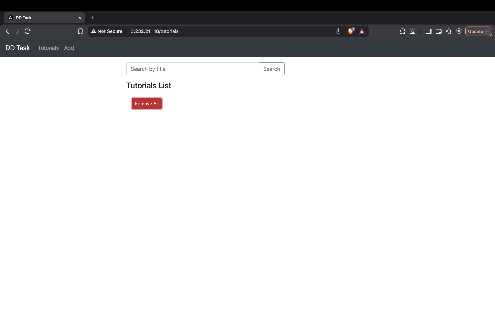
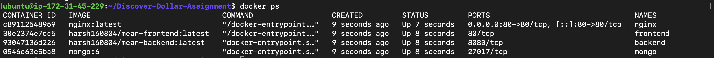
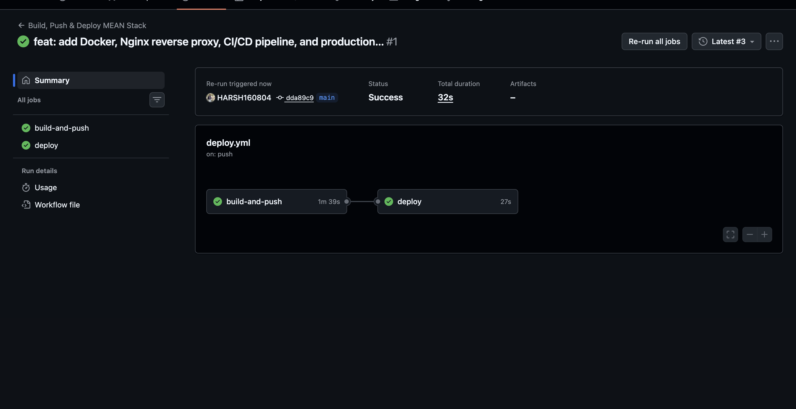
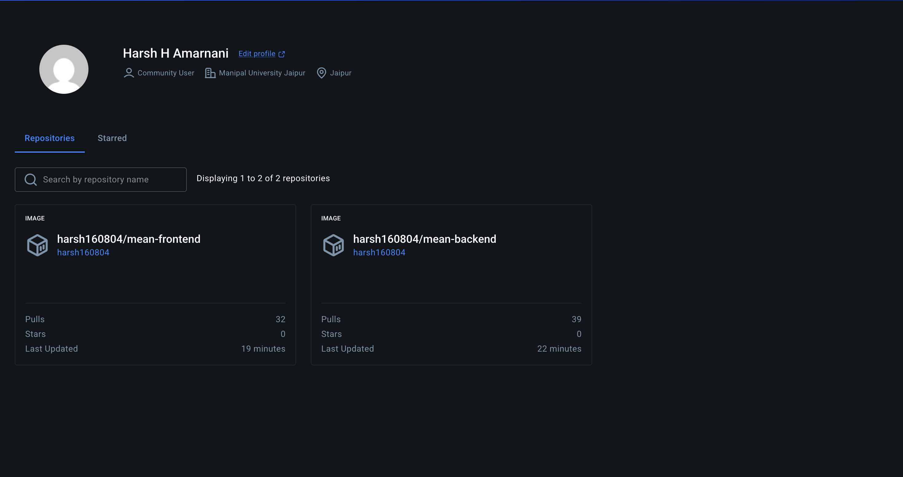
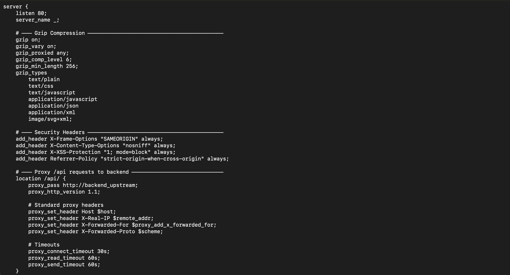
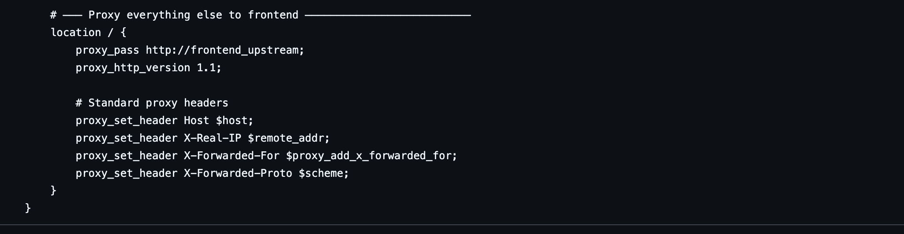

# MEAN Stack CRUD Application -- Containerized Deployment

## Project Overview

This project demonstrates the end-to-end containerization, CI/CD automation, and cloud deployment of a full-stack MEAN (MongoDB, Express.js, Angular, Node.js) application.

The application is a Tutorial Management System that provides full CRUD functionality -- users can create, view, update, delete, and search tutorials. Each tutorial contains a title, description, and published status.

**What this deployment demonstrates:**

- Multi-container Docker architecture with isolated services
- Multi-stage Docker builds for optimized production images
- Nginx reverse proxy routing all traffic through port 80
- Automated CI/CD pipeline using GitHub Actions
- Docker Hub as a container image registry
- One-command deployment on a cloud Ubuntu VM using Docker Compose

---

## Architecture Overview

### Request Flow

```
Browser (Port 80)
    |
    v
Nginx Reverse Proxy
    |
    |--- /           -->  Frontend Container (Angular, served via Nginx)
    |--- /api/*      -->  Backend Container (Node.js + Express, Port 8080)
                               |
                               v
                          MongoDB Container (Port 27017)
```

All inter-service communication occurs over an internal Docker bridge network. Only port 80 is exposed to the host. The Nginx reverse proxy serves as the single entry point, routing static frontend requests and API calls to their respective containers. This eliminates CORS issues, provides a clean URL structure, and mirrors production-grade infrastructure.

### CI/CD Flow

```
Developer pushes to main branch
    |
    v
GitHub Actions Workflow Triggered
    |
    |--- Build backend Docker image
    |--- Build frontend Docker image
    |--- Push both images to Docker Hub
    |
    v
SSH into Ubuntu VM
    |
    |--- Pull latest images from Docker Hub
    |--- Restart containers via Docker Compose
    |
    v
Application is live on the VM
```

---

## Tech Stack

| Component         | Technology                |
|-------------------|---------------------------|
| Frontend          | Angular 15                |
| Backend           | Node.js + Express.js      |
| Database          | MongoDB 6                 |
| Containerization  | Docker, Docker Compose    |
| Reverse Proxy     | Nginx                     |
| CI/CD             | GitHub Actions            |
| Image Registry    | Docker Hub                |
| Cloud Platform    | Ubuntu VM (AWS/Azure/GCP) |

---

## Repository Structure

```
.
├── backend/                       # Node.js + Express REST API
│   ├── app/
│   │   ├── config/db.config.js    # MongoDB connection configuration
│   │   ├── controllers/           # Request handlers
│   │   ├── models/                # Mongoose models
│   │   └── routes/                # API route definitions
│   ├── server.js                  # Application entry point
│   ├── Dockerfile                 # Backend Docker image definition
│   └── .dockerignore
│
├── frontend/                      # Angular 15 application
│   ├── src/                       # Angular source code
│   ├── nginx.conf                 # Nginx config for serving Angular (internal)
│   ├── Dockerfile                 # Multi-stage build: Angular build + Nginx serve
│   └── .dockerignore
│
├── nginx/
│   └── nginx-proxy.conf           # Nginx reverse proxy configuration
│
├── .github/
│   └── workflows/
│       └── deploy.yml             # GitHub Actions CI/CD pipeline
│
├── docker-compose.yml             # Production Docker Compose (4 services)
├── docker-compose.local.yml       # Local development override (adds build contexts)
└── README.md
```

---

## Setup and Deployment Instructions

### Prerequisites

- Docker and Docker Compose installed on local machine or target VM
- Docker Hub account with access token
- Ubuntu VM on any cloud provider (AWS, Azure, GCP)
- GitHub repository with the following secrets configured:
  - `DOCKERHUB_USERNAME`
  - `DOCKERHUB_TOKEN`
  - `VM_HOST`
  - `VM_SSH_KEY`

### Local Testing

Build both images locally and start the full stack:

```bash
docker build -t harsh160804/mean-backend:latest ./backend
docker build -t harsh160804/mean-frontend:latest ./frontend
docker compose up -d
```

Verify at `http://localhost`. Stop with `docker compose down`.

Alternatively, use the local override file:

```bash
docker compose -f docker-compose.yml -f docker-compose.local.yml up --build -d
```

### Cloud VM Deployment

1. **Provision an Ubuntu VM** on your preferred cloud platform.

2. **Install Docker and Docker Compose** on the VM:

   ```bash
   sudo apt update
   sudo apt install -y docker.io docker-compose-plugin
   sudo usermod -aG docker ubuntu
   ```

3. **Clone the repository** on the VM:

   ```bash
   git clone https://github.com/HARSH160804/Discover-Dollar-Assignment.git
   cd Discover-Dollar-Assignment
   ```

4. **Start the application**:

   ```bash
   docker compose pull
   docker compose up -d
   ```

5. The application is now accessible at `http://<VM_PUBLIC_IP>`.

---

## CI/CD Pipeline

The CI/CD pipeline is defined in `.github/workflows/deploy.yml` and is triggered on every push to the `main` branch.

### Pipeline Stages

| Stage              | Description                                                   |
|--------------------|---------------------------------------------------------------|
| **Build and Push** | Builds Docker images for frontend and backend, pushes to Docker Hub |
| **Deploy**         | SSHs into the Ubuntu VM, pulls the latest images, restarts containers |

### Build and Push Stage

- Checks out the repository code
- Logs in to Docker Hub using `DOCKERHUB_USERNAME` and `DOCKERHUB_TOKEN` secrets
- Builds the backend image from `./backend/Dockerfile`
- Builds the frontend image from `./frontend/Dockerfile` (multi-stage build)
- Tags both images as `latest` and pushes to Docker Hub

### Deploy Stage

- Connects to the Ubuntu VM via SSH using `VM_HOST` and `VM_SSH_KEY` secrets
- Navigates to the project directory on the VM
- Runs `docker compose pull` to fetch the latest images
- Runs `docker compose up -d` to restart containers with zero manual intervention
- Uses `set -e` to fail immediately on any error

---

## Environment Variables

| Variable       | Service  | Description                              | Example Value                          |
|----------------|----------|------------------------------------------|----------------------------------------|
| `MONGODB_URI`  | backend  | MongoDB connection string                | `mongodb://mongo:27017/dd_db`          |
| `PORT`         | backend  | Port the Express server listens on       | `8080`                                 |

These variables are defined in `docker-compose.yml` and injected at container runtime. No secrets are stored in the codebase.

---

## Verification

### Check Running Containers

```bash
docker compose ps
```

All four containers (`mongo`, `backend`, `frontend`, `nginx`) should show status `Up`.

### Verify Frontend

```bash
curl -s -o /dev/null -w "%{http_code}" http://localhost
```

Expected response: `200`

### Verify Backend API

```bash
curl http://localhost/api/tutorials
```

Expected response: `[]` (empty array) or a JSON array of tutorials.

### Verify MongoDB Persistence

```bash
# Create a tutorial
curl -X POST http://localhost/api/tutorials \
  -H "Content-Type: application/json" \
  -d '{"title":"Test","description":"Persistence check"}'

# Restart containers
docker compose restart

# Verify data persists
curl http://localhost/api/tutorials
```

The tutorial created before the restart should still be present in the response.

---

## Screenshots

### Application Running on AWS



### Running Containers on EC2



### CI/CD Pipeline Execution



### Docker Hub Images



### Nginx Reverse Proxy Configuration





---

## Conclusion

This project demonstrates a complete, production-ready DevOps workflow for a full-stack MEAN application:

- **Containerization**: Each service runs in its own isolated Docker container with optimized, multi-stage builds for the frontend.
- **Orchestration**: Docker Compose manages all four services (MongoDB, Backend, Frontend, Nginx) with defined dependencies, networking, and persistent storage.
- **Reverse Proxy**: Nginx provides a single entry point on port 80, routing traffic to the appropriate service and implementing security headers and gzip compression.
- **CI/CD Automation**: Every push to the `main` branch triggers an automated pipeline that builds images, pushes them to Docker Hub, and deploys to the cloud VM without manual intervention.
- **Cloud Deployment**: The application runs on an Ubuntu VM and is accessible over the internet, replicating a real-world production deployment.

All configuration files, pipeline definitions, and deployment instructions are included in this repository for complete reproducibility.
